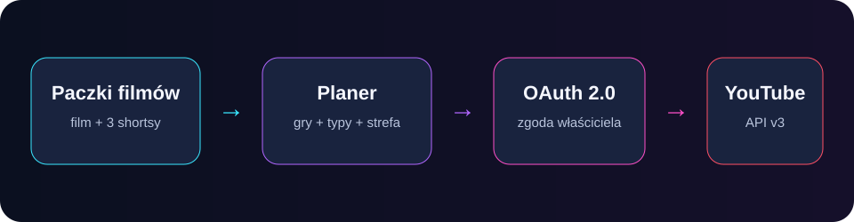

# Divithy YouTube Publisher

[](https://github.com/Divithy-IT/divithy-youtube-publisher/actions/workflows/checks.yml)


Lokalny publikator, który zamienia gotowe paczki filmów w uporządkowany
harmonogram kanału YouTube. Obsługuje tytuły, opisy, tagi, miniatury,
playlisty, shortsy, filmy główne i planowane daty publikacji.



## Najważniejsze możliwości

- pięciodniowy rytm „film główny najpierw”: odcinki w dniach 1 i 3 o 15:00,
  a po nich po trzy powiązane Shortsy;
- naprzemienna kolejka gier, np. `L4D2 → PUBG → L4D2`;
- przeplatanie kompilacji i pełnych rozgrywek wewnątrz każdej gry;
- wyszukiwanie istniejących playlist i tworzenie brakujących;
- podgląd całego planu przed wysłaniem czegokolwiek;
- wznowienie po przerwaniu bez ponownego wysyłania gotowych pozycji;
- aplikacja okienkowa oraz tryb CLI do automatyzacji.

## Szybki start na Windows

1. Pobierz repozytorium i uruchom `Instalacja.bat`.
2. Skopiuj `publisher_config.example.json` do `publisher_config.json`.
3. Ustaw `content_root`, datę startu i lokalną ścieżkę do klienta OAuth.
4. Uruchom `Uruchom_publikator.bat`.
5. Najpierw wybierz **Przygotuj podgląd**, a dopiero potem połącz konto.

Pełna instrukcja konfiguracji Google znajduje się w
[INSTRUKCJA_AUTORYZACJI.md](INSTRUKCJA_AUTORYZACJI.md).

## Układ paczki

```text
Filmy YouTube/
└── film5/
    ├── Divithy_L4D2_Odcinek_05.mp4
    ├── Short_01.mp4
    ├── Short_02.mp4
    ├── Short_03.mp4
    ├── Miniatura_05.jpg
    ├── YouTube_05.txt
    ├── gra.txt              # opcjonalnie: L4D2
    └── typ.txt              # kompilacja lub pelna_rozgrywka
```

Paczka pełnej rozgrywki może nie mieć shortsów. Plik metadanych zawiera
sekcje `FILM GŁÓWNY` oraz, jeśli występują, `SHORT 1` do `SHORT 3`.

Domyślny cykl dwóch paczek:

- dzień 1: film A 15:00, Shorts A1 18:00;
- dzień 2: Shorts A2 18:00;
- dzień 3: film B 15:00, Shorts B1 18:00;
- dzień 4: Shorts B2 18:00;
- dzień 5: Shorts A3 15:00, Shorts B3 18:00.

Sloty Luźnej sceny (dzień 2, 15:00) i materiału poradnikowego (dzień 4,
15:00) są obsługiwane przez rozszerzony lokalny workflow kanału.

## Konfiguracja

### Zasady kanału i zakres kopii

Aktualne ustalenia produkcyjne i publikacyjne opisuje
[polityka projektu](docs/ZASADY_KANALU.txt), a limity pracy i reguły wznawiania
[ochrona budżetu](docs/ZASADY_BUDZETU.txt).
Są to zasady rozszerzonego procesu kanału, nie deklaracja, że każda z nich
jest już zaimplementowana w tym publicznym wydaniu aplikacji.

Repozytorium przechowuje publiczny kod i dokumentację. Nie jest pełną kopią
roboczego środowiska: nie zawiera wszystkich lokalnych narzędzi operacyjnych,
tokenów OAuth, rejestrów uploadu, prywatnego harmonogramu, napisów ani nagrań.
Do odtworzenia kolejki po awarii potrzebna jest osobna prywatna kopia stanów,
manifestów i zatwierdzonych assetów. Nie wolno odtwarzać kolejki samym ponownym
uploadem plików — najpierw trzeba uzgodnić istniejące identyfikatory YouTube.

Najważniejsze pola w `publisher_config.json`:

| Pole | Znaczenie |
|---|---|
| `content_root` | katalog zawierający paczki `film5`, `film6` itd. |
| `start_date` | pierwszy dzień kolejki w formacie `RRRR-MM-DD` |
| `timezone` | strefa publikacji, domyślnie `Europe/Warsaw` |
| `game_order` | preferowana kolejność serii |
| `type_order` | kolejność kompilacji i pełnych rozgrywek |
| `playlist_names` | mapowanie gry na nazwę playlisty |
| `api_audited` | potwierdzenie audytu projektu YouTube API |

## Bezpieczny przebieg

Podgląd planu niczego nie publikuje. Realne wysłanie wymaga osobnej zgody.
Stan ukończonych operacji trafia do ignorowanego pliku `upload_state.json`.
Sekrety klienta, tokeny OAuth, lokalna konfiguracja i filmy są blokowane przez
`.gitignore`.

Jeśli projekt Google nie przeszedł audytu YouTube API Services, pozostaw
`api_audited` jako `false`. YouTube może wymusić prywatność materiałów
wysłanych przez niezweryfikowany projekt.

## Testy i rozwój

```powershell
python -m venv .venv
.\.venv\Scripts\Activate.ps1
pip install -r requirements.txt
python -m unittest discover -s tests -v
```

Zasady współpracy opisuje [CONTRIBUTING.md](CONTRIBUTING.md), zmiany
[CHANGELOG.md](CHANGELOG.md), a zgłoszenia bezpieczeństwa
[SECURITY.md](SECURITY.md).

## YouTube API compliance

Divithy Publisher uses Google OAuth 2.0 and the YouTube Data API only for the
actions requested by the authorized channel owner. Review the public
[Privacy Policy](PRIVACY.md) and [Terms of Service](TERMS.md). Access can be
revoked at any time from [Google Account third-party
connections](https://myaccount.google.com/connections).

## English

Divithy YouTube Publisher is a local Python application that validates content
packages and schedules YouTube videos, Shorts, thumbnails, metadata and
playlists through the YouTube Data API v3. It alternates games and content
types, supports resumable uploads, and always provides a preview before any
remote change. See the quick-start steps above or open an issue in English.

## Licencja

[MIT](LICENSE) © 2026 Michał Lemanczyk.
